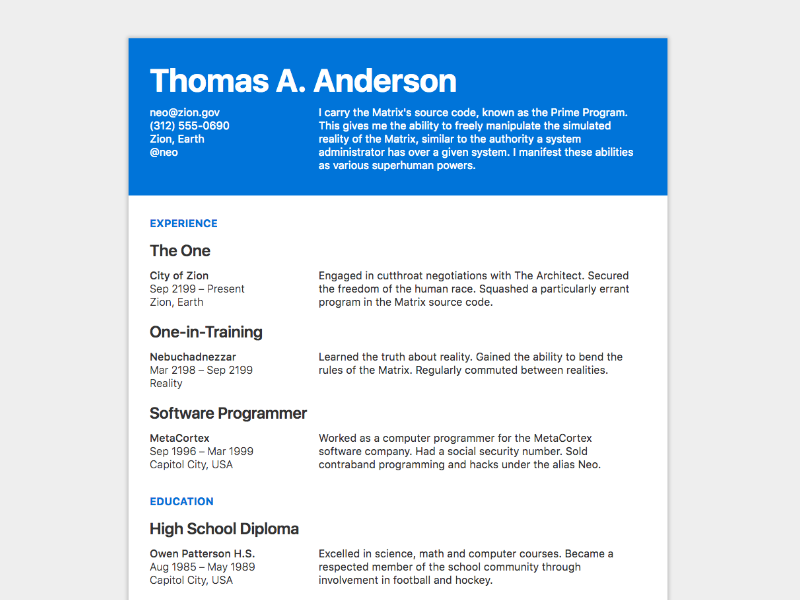

# Metalsmith Resume



Listen, writing resumes sucks. Microsoft Word and Adobe InDesign were not meant to be layout or content editing tools, respectively, and neither excel at managing information. I wanted to change that for myself, so I made my resume as a [Metalsmith](http://metalsmith.io) minisite. Then I made a better one to give away to everyone else (this thing you're looking at now). The math is simple: `markdown + YAML + git > those other things I just mentioned`.

## Editing

1. Fork this repo
2. Open the project on [Prose](http://prose.io)
3. Edit and add files
4. ???
5. Profit (hopefully literally)

### Adding Experiences

The most important part of any resume is, of course, showing off your bad self. The whole point of this project is to make that easier. So anyways, jobs live in the [`/experience`](/source/experience) subdirectory and schools in the [`/education`](/source/education) one. Each is it's own `.md` file with YAML metadata.

#### Metadata

As mentioned above, the easiest way to edit your resume is with [Prose](http://prose.io). Each job/school is expecting a few metadata fields, and Prose shows all those fields to you. I'm not gonna list them all out here for you, so the second easiest way is to just look at [an](/source/experience/zion.md) [existing](/source/experience/nebuchadnezzar.md) [experience](/source/education/owen-patterson.md) and copy that.

### Personal Information

The [`person.yaml`](/source/person.yaml) file is your key to making this resume your own. That's it for this section. ¯\\\_(ツ)\_/¯

### Site Settings

You can adjust display and styling settings in the [`site.yaml`](/source/site.yaml) file.

#### Set Number of Items to Show

The `jobs` and `schools` variables let you adjust the number of jobs & schools that are shown on the resume. I'll let the surprise settle in. Setting a variable to zero will hide the section completely. Full job & school histories are available at `/experience` & `/education`, respectively, regardless of these settings.

#### Theme Color

You can set your theme with the `theme` variable. I'll one again wait to let the shock wash over you. It will automagically™ check if your theme color has a high enough contrast ratio against white and adjust the styles accordingly. For best results, choose a color that has a color contrast ratio of at least 3.5 with white. [Hey look, a calculator](http://leaverou.github.io/contrast-ratio/)!

#### Print Styles

There is a setting called `printstyles`. This is probably a bad name. I should update this name. 🤔 Anyways, what it does is it makes everything black and white when you try and print the resume.

## Generating a PDF

...is a much bigger headache than it would seem. You can always `cmd + p` and use the browser to save a PDF, but I built a nice generation function for you anyways. Unfortunately, it's a little jank right now. It uses [node-html-pdf](https://github.com/marcbachmann/node-html-pdf), which in turn uses [PhantomJS](http://phantomjs.org/), which causes some weird text zoom issue. So I have to:

1. Rebuild the site with a print environment flag that applies a global font de-scalification
3. Do the whole PDF generation thing (the whole point of this exercise)
4. Rebuild the site *without* the print flag

...it takes like, I dunno, 5 or 10 seconds? Which feels like *forever*. Anyways, you can generate a PDF with `npm run pdf` (or, again, just push `cmd + p` when you have it up and running).

## Development

### Installation

```
git clone https://github.com/lowmess/metalsmith-resume.git
cd metalsmith-resume
npm i
```

### Local Server

[Browsersync](https://www.browsersync.io/) & [nodemon](http://nodemon.io/) is a match made in heaven. Luckily for you, it's already all set up! Just run `npm start` from the root directory of your repo and begin hacking away.

### Building

`npm run build` will build the resume site for you into the `_build` directory. Pretty straightforward.

### Styling

This project uses [Tachyons](http://tachyons.io) (with a few custom classes added in for good measure). All modules are included in the build, which is then run through a few performance-enhancing PostCSS plugins (PEPP'rd) like [UnCSS](https://github.com/giakki/uncss) & [cssnano](http://cssnano.co/). As of right now, all the loaded CSS is [~3kb](http://cssstats.com/stats?url=http%3A%2F%2Fmetalsmith-resume.lowmess.com&ua=Browser%20Default), and that's pretty damn cool.[1] 🤓

## Contributing

Contributions are welcome and encouraged:

1. Fork the project
2. Make your changes
3. Open a PR that has a descriptive name (or a robust description)
4. Feel good about yourself 🎉

***

[1] For reference, this long-as-hell README is, like, almost five goddamn KBs. The whole generated site is [3.24kb gzipped](https://gtmetrix.com/reports/metalsmith-resume.lowmess.com/oQim8iPf).
